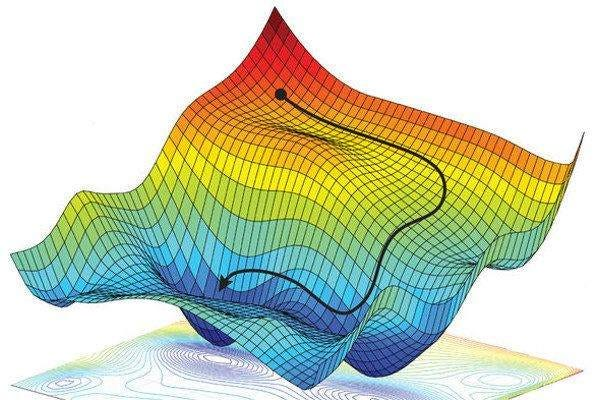

# CUDAgrad

Inspired by [@karpathy's - micrograd](https://github.com/karpathy/micrograd).



An autograd engine is the technical implementation of backpropogation algorithm that allows neural nets to learn.
This is a implementation of a very lightweight autograd engine using C and CUDA for gpu acceleration.

## Dependencies

- CUDA toolkit
- C compiler (e.g., GCC, Clang)

## Getting Started

1. Clone the repository:

   ```bash
   git clone https://github.com/AndrewBoessen/CUDAgrad
   ```

2. Navigate to the project directory:

   ```bash
   cd CUDAgrad
   ```

3. Build the project:

   ```bash
   make
   ```

## Example Usage

Here is a example of how to create a simple expression with the autograd engine

```c
#include <stdio.h>
#include <stdlib.h>

#include "engine.h"

int main(int argc, char** argv) {
    // Test add and subtract
    Value* x = init_value(1.0);
    Value* y = init_value(1.5);

    Value* sum = add(x,y);

    Value* t = init_value(3.0);

    // Z = (X + Y) - T
    Value* z = sub(sum, t);

    // Outputs expression in postfix notation:
    // X Y + T - = Z
    print_expression(z);

    return EXIT_SUCCESS;
}
```

Output:

```bash
1.00 1.50 + 3.00 - = -0.50
```

## Neural Network


Using the nueral network library, it is easy to create a MLP and train on it.

The library uses GPU acceleration for the forward pass and for training.

### Example Usage

Simple MLP with 3 hidden layers

```c
#include "nn.h"
#include "engine.h"

int main() {
    int n_inputs = 2;
    int n_outputs = 2;

    // Define the sizes of the layers
    int sizes[] = {n_inputs, 5, 10, 5, n_outputs};
    int nlayers = sizeof(sizes) / sizeof(int);

    MLP* mlp = init_mlp(sizes, nlayers);
    show_params(mlp);

    // Allocate inputs
    Value** in;
    allocValueArr(&in, n_inputs);
    // Set inputs
    in[0] = init_value(1.0);
    in[1] = init_value(1.0);

    // Compute outputs with forward pass
    Value** out = mlp_forward(mlp, in, n_inputs);

    print_value(out[0]);
    print_value(out[1]);
}
```

### Demo - Make Moons

This is an example training a MLP for classification on the [make moons](https://scikit-learn.org/stable/modules/generated/sklearn.datasets.make_moons.html) dataset


This example uses a MLP with an input layer with 2 neurons for X and Y cordinates, 3 hidden layers of 5, 10, and 5 neurons respectively and a single output neuron for binary classification.

To train, use stochastic gradient descent. In this example, the network is trained for 15 epochs with a batch size of 10. This implements a variable learning rate that decreases with epoch index.

```c
/*
 * Train MLP for make moons classification
 */
#include <stdlib.h>
#include <time.h>
#include <stdio.h>
#include <math.h>

#include "nn.h"
#include "engine.h"
#include "data.h"

#define EPOCHS 15
#define BATCH_SIZE 10
#define LEARNING_RATE 0.01
#define DATA_SIZE 1000
#define TRAIN_SIZE 900
#define TEST_SIZE 100
#define NUM_INPUTS 2
#define NUM_OUTPUTS 1

/**
 * Swaps two Entry structs in the array.
 */
void swap_entries(Entry* a, Entry* b) {
    Entry temp = *a;
    *a = *b;
    *b = temp;
}

/**
 * Shuffles the array of Entry structs using the Fisher-Yates shuffle algorithm.
 */
void shuffle_entries(Entry* entries, int count) {
    for (int i = count - 1; i > 0; i--) {
        int j = rand() % (i + 1);
        swap_entries(&entries[i], &entries[j]);
    }
}

int main() {
    // Seed the random number generator
    srand(time(NULL));
    
    // Load data from data file
    Entry entries[DATA_SIZE];
    const char *filename = "./data/make_moons.csv";
    int num_entries = load_data(filename, entries);

    if (num_entries == -1) {
        fprintf(stderr, "Failed to load data from file %s\n", filename);
        return EXIT_FAILURE;
    }

    printf("Loaded %d entries from %s\n", num_entries, filename);

    // Init MLP
    int sizes[] = {NUM_INPUTS, 5, 10, 5, NUM_OUTPUTS};
    int nlayers = sizeof(sizes) / sizeof(int);

    MLP* mlp = init_mlp(sizes, nlayers);

    // Batch data and ground truth
    float* inputs = (float*)malloc(NUM_INPUTS * BATCH_SIZE * sizeof(float));
    float* grnd_truth = (float*)malloc(NUM_OUTPUTS * BATCH_SIZE * sizeof(float));

    // Shuffle entries before taking training dataset
    shuffle_entries(entries, DATA_SIZE);

    printf("Training for %d Epochs with Batch Size %d\n", EPOCHS, BATCH_SIZE);
    // Train for number of epochs
    for (int i = 0; i < EPOCHS; i++) {
        float epoch_loss = 0.0;

        // Variable learning rate
        float lr = LEARNING_RATE - (0.009 * ((float)(i+1)/EPOCHS));

        // Only train on training set
        shuffle_entries(entries, TRAIN_SIZE);
        // SGD - calculate loss for a batch of 10 data points
        for (int j = 0; j < TRAIN_SIZE / BATCH_SIZE; j++) {
            // starting index
            int starting_idx = j * BATCH_SIZE;
            
            // Select next 10 unvisited datapoints in shuffled array
            for (int n = 0; n < BATCH_SIZE; n++) {
                Entry curr_entry = entries[starting_idx + n];
                // add to bath inputs
                inputs[n * NUM_INPUTS] = curr_entry.x;
                inputs[n * NUM_INPUTS + 1] = curr_entry.y;
                
                // Expected y
                grnd_truth[n * NUM_OUTPUTS] = curr_entry.label;
            }
            Value** in = init_values(inputs, NUM_INPUTS * BATCH_SIZE);
            Value** gt = init_values(grnd_truth, NUM_OUTPUTS * BATCH_SIZE);

            // Train batch
            float batch_loss = train(mlp, in, NUM_INPUTS, gt, lr, BATCH_SIZE);
            // Add to epoch loss
            epoch_loss += batch_loss;
        }
        // Evaluate Accuracy
        int correct = 0;
        for (int i = 0; i < TEST_SIZE; i++){
            Entry curr_entry = entries[TRAIN_SIZE + i];
            float inputs[NUM_INPUTS] = {curr_entry.x, curr_entry.y};
            Value** curr_in = init_values(inputs, NUM_INPUTS);
            Value** out = mlp_forward(mlp, curr_in, NUM_INPUTS);
            // Calculate Accracy against ground truth
            if (pow((curr_entry.label - out[0]->val),2) <= 0.05) {
                correct++;
            }
        }

        printf("EPOCH: %d LOSS: %f ACCURACY: %.d%%\n", i+1, epoch_loss / TRAIN_SIZE, 100 * correct / TEST_SIZE);
    }

    return EXIT_SUCCESS;
}
```

Output:

```
Loaded 1000 entries from ./data/make_moons.csv
Training for 15 Epochs with Batch Size 10
EPOCH: 1 LOSS: 0.145347 ACCURACY: 66%
EPOCH: 2 LOSS: 0.039866 ACCURACY: 89%
EPOCH: 3 LOSS: 0.018161 ACCURACY: 87%
EPOCH: 4 LOSS: 0.014457 ACCURACY: 93%
EPOCH: 5 LOSS: 0.009392 ACCURACY: 94%
EPOCH: 6 LOSS: 0.007776 ACCURACY: 96%
EPOCH: 7 LOSS: 0.007002 ACCURACY: 97%
EPOCH: 8 LOSS: 0.006361 ACCURACY: 98%
EPOCH: 9 LOSS: 0.005671 ACCURACY: 98%
EPOCH: 10 LOSS: 0.005193 ACCURACY: 98%
EPOCH: 11 LOSS: 0.004624 ACCURACY: 97%
EPOCH: 12 LOSS: 0.004551 ACCURACY: 98%
EPOCH: 13 LOSS: 0.004331 ACCURACY: 97%
EPOCH: 14 LOSS: 0.004237 ACCURACY: 97%
EPOCH: 15 LOSS: 0.004082 ACCURACY: 98%
```

## License

This project is licensed under the MIT License - see the [LICENSE](LICENSE) file for details.
